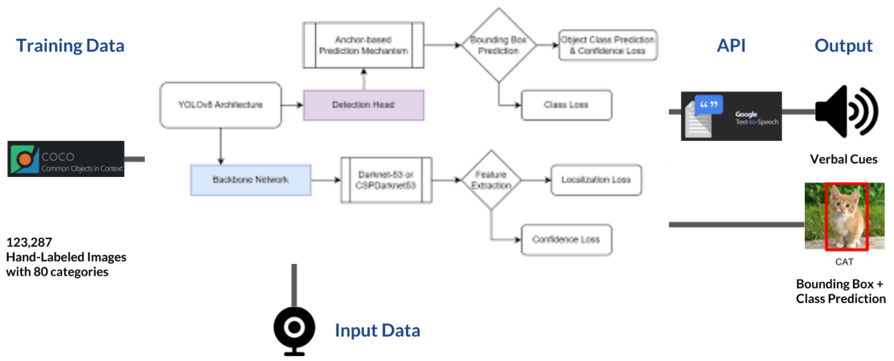

# Object-Detection-with-Voice-Feedback-YOLO-v8-and-gTTS

Object Detection is a field of Computer Vision that detects instances of semantic objects in images/videos (by creating bounding boxes around them in our case). We can then convert the annotated text into voice responses and give the basic positions of the objects in the person/camera’s view.

## A Very High-Level Overview

<p align="center">
 
</p>

1. **Training Data**: The model is trained with the [Common Objects In Context](https://cocodataset.org/#explore) (COCO) dataset. You can explore the images that they labeled in the link, it’s pretty cool.

2. **Model**: The model here is the You Only Look Once (YOLO) algorithm that runs through a variation of an extremely complex Convolutional Neural Network architecture called the Darknet. We are using the more advanced YOLO v8 model. The Python cv2 package has a method to set up Darknet from our configurations in the `yolov8.cfg` file. COCO has already been trained on YOLO v8 by others, so we will be using a pre-trained model and have already obtained the weights stored in a 200+ MB file.

3. **Input Data**: We will be using static images and feed them to this trained model.

4. **API**: The class prediction of the objects detected in every image will be a string, e.g., “cat”. We will also obtain the coordinates of the objects in the image and append the position “top”/“mid”/“bottom” & “left”/“center”/“right” to the class prediction “cat”. We can then send the text description to the Google Text-to-Speech API using the gTTS package.

5. **Output**: We will be getting voice feedbacks in the form, e.g., “bottom left cat” — meaning a cat was detected on the bottom-left of my camera view using the Google Text-to-Speech API via the gTTS package by providing a text description of the object.

## Voice Feedback

We can use `bx` & `by` relative to `W` & `H` to determine the position of the objects detected and send it as a text string to gTTS.

### Note:
You need to download the [yolo pretrained weights](https://pjreddie.com/media/files/yolov8.weights) to get started with the code.

## Usage

To use this repository, follow these steps:

1. Clone the repository:
   ```sh
   git clone https://github.com/yourusername/Object-Detection-with-Voice-Feedback-YOLO-v8-and-gTTS.git
   cd Object-Detection-with-Voice-Feedback-YOLO-v8-and-gTTS
   ```

2. Download the YOLO v8 weights and place them in the directory:
   ```sh
   wget https://pjreddie.com/media/files/yolov8.weights -P path/to/weights/directory
   ```

3. Install the required packages:
   ```sh
   pip install -r requirements.txt
   ```

4. Run the object detection script:
   ```sh
   python script.py -i path/to/image.jpg -y path/to/yolo_directory
   ```

Ensure that your `yolo_directory` contains the `yolov8.cfg`, `coco.names`, and `yolov8.weights` files. Modify the script as necessary to fit your specific setup and requirements.
